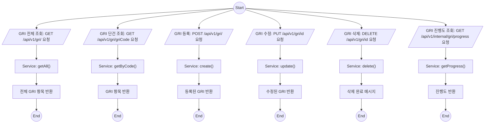

```mermaid
flowchart TD
    start((Start))

%% GRI 전체 조회
    start --> griGetAll[/GRI 전체 조회: GET /api/v1/gri/ 요청/]
    griGetAll --> griGetAllSvc["Service: getAll()"]
    griGetAllSvc --> griGetAllResp["전체 GRI 항목 반환"]
    griGetAllResp --> end1((End))

%% GRI 단건 조회
    start --> griGetOne[/GRI 단건 조회: GET /api/v1/gri/griCode 요청/]
    griGetOne --> griGetOneSvc["Service: getByCode()"]
    griGetOneSvc --> griGetOneResp["GRI 항목 반환"]
    griGetOneResp --> end2((End))

%% GRI 등록
    start --> griPost[/GRI 등록: POST /api/v1/gri/ 요청/]
    griPost --> griPostSvc["Service: create()"]
    griPostSvc --> griPostResp["등록된 GRI 반환"]
    griPostResp --> end3((End))

%% GRI 수정
    start --> griPut[/GRI 수정: PUT /api/v1/gri/id 요청/]
    griPut --> griPutSvc["Service: update()"]
    griPutSvc --> griPutResp["수정된 GRI 반환"]
    griPutResp --> end4((End))

%% GRI 삭제
    start --> griDelete[/GRI 삭제: DELETE /api/v1/gri/id 요청/]
    griDelete --> griDeleteSvc["Service: delete()"]
    griDeleteSvc --> griDeleteResp["삭제 완료 메시지"]
    griDeleteResp --> end5((End))

%% GRI 진행도 조회
    start --> griProgress[/GRI 진행도 조회: GET /api/v1/internal/gri/progress 요청/]
    griProgress --> griProgressSvc["Service: getProgress()"]
    griProgressSvc --> griProgressResp["진행도 반환"]
    griProgressResp --> end6((End))
```