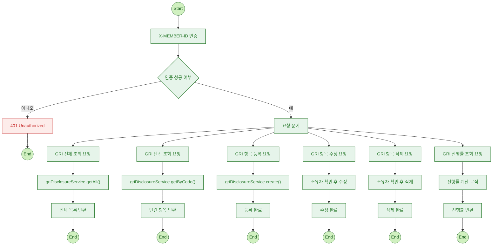

# 📘 GRI 공시 항목 관리 서비스

GRI(Global Reporting Initiative) 기준에 따라 기업의 지속가능 경영 데이터를 항목별로 등록, 수정, 분석할 수 있는 서비스입니다.  
ESG 공시 대응을 위한 핵심 기능 중 하나로, 사용자가 입력한 데이터를 바탕으로 진행률을 자동 계산하여 관리 효율성을 높입니다.

---

## ✅ 주요 기능

| 기능 | 설명 |
|------|------|
| GRI 전체 조회 | 전체 GRI 항목을 목록 형태로 조회 |
| GRI 단건 조회 | 코드 기반 특정 항목 상세 조회 |
| GRI 등록 | 새로운 GRI 항목 입력 |
| GRI 수정 | 기존 항목 수정 (소유자 확인 포함) |
| GRI 삭제 | 항목 삭제 (소유자 확인 포함) |
| GRI 진행률 조회 | 전체 항목 중 입력 완료 항목의 비율 계산 |

---

## 🔒 인증 흐름

- 모든 요청은 공통적으로 `X-MEMBER-ID` 헤더 인증을 요구합니다.
- 인증 실패 시 `401 Unauthorized` 응답을 반환하고 요청 처리를 중단합니다.

---

## 🔄 서비스 흐름도

